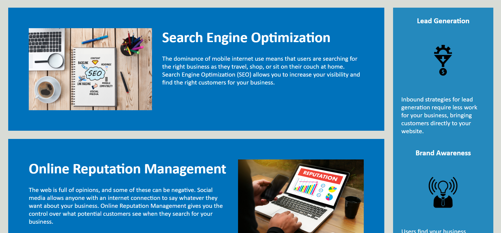
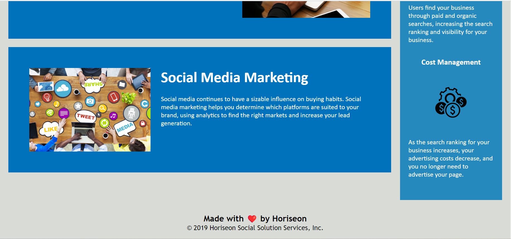

# week-1-challenge
# <week 1 challenge>

## Description 
this project was to edit the given code to make it more accessible and readable throught html semantics
this was required because the use of 
 can confuse the reader or peer reviewer

## Table of Contents (Optional)
style.css
images
index.html
READ.ME

## Installation

to access this website you just have to right click on the html page and select run default browser, then the webpage should come up in the correct form

## Usage

to use you can click on any of the nav buttons and browse as if it were a regular website

## Credits

N/A

#Application link
https://colechaffin.github.io/week-1-challenge/

